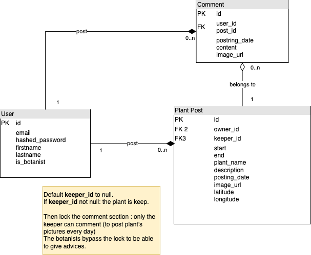

= MSPR EPSI 2022

https://fastapi.tiangolo.com/[FastAPI] code is located in link:api/[api/] folder.

https://angular.io/[Angular] frontend code is located in link:web/[web/] folder.

== Design

=== Security and GDPR complience

See the link:documentation/security.adoc[Security document] and the link:documentation/gdpr-complience.adoc[GDPR complience document].

=== Generated documentation

See link:https://fabien-jrt.gitlab.io/mspr-epsi-2022/app.html[the generated documentation of the api server].

=== Database

== Contributing

Use gitlab issues and merge request to contribute to this project.

=== Windows

. Make sure WSL2 is installed
 .. Follow steps in https://learn.microsoft.com/fr-fr/windows/wsl/install[this link]
 .. When you set the WSL version to 2, if it returns an error. Follow steps at https://learn.microsoft.com/fr-fr/windows/wsl/install-manual#step-4---download-the-linux-kernel-update-package[this link] to debug it
. Make sure docker desktop is https://docs.docker.com/desktop/install/windows-install/[installed] *and running*
. Start Powershell to get the ip adress of your WSL
 .. Type `wsl`
 .. Type `ip a`
 .. Under `ethx` copy the ip address
. Open a terminal and go to `MSPR-EPSI-2022/api/`
. Use `docker-compose build` and `docker-compose up` to build and run the app
. In your web browser go to `http://<url-got-at-step-3>/` to query the API
. In your web browser go to `http://<url-got-at-step-3>/docs` to get the API's documentation (https://swagger.io/[Swagger])

=== Macos and Linux

. Make sure dockerd or docker desktop is running
. Make sure you are in `MSPR-EPSI-2022/api/`
. Use `docker-compose build` and `docker-compose up` to build and run the app
. Go to `+http://127.0.0.1/+` (or use the url of the docker container) to use the API
. Go to `+http://127.0.0.1/docs+` (or use the conatainer's URL) to get the API's documentation (https://swagger.io/[Swagger])
